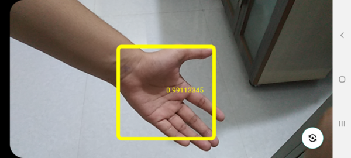
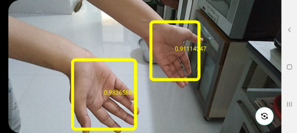

<center><h1>Hand Detection using TFLite in Android</h1></center>

> **An Android app which uses models from [Victor Dibia](https://github.com/victordibia)'s 
> popular [handtracking](https://github.com/victordibia/handtracking) repo.**




## TFLite Conversion Script

A complete step-by-step guide on how to convert the model checkpoints from the 
[handtracking](https://github.com/victordibia/handtracking) repo could be 
found here --> [Google_Colab_Notebooks/Hand_Tracking_Model_TFLite_Conversion.ipynb](https://github.com/shubham0204/Google_Colab_Notebooks/blob/main/Hand_Tracking_Model_TFLite_Conversion.ipynb)

[](https://colab.research.google.com/github/shubham0204/Google_Colab_Notebooks/blob/main/Hand_Tracking_Model_TFLite_Conversion.ipynb)

## Project Information

The following features are included in the project,

1. Well documented code with links to SO answers wherever required.
2. Uses latest APIs like [CameraX](https://developer.android.com/training/camerax) and [Kotlin Coroutines](https://developer.android.com/kotlin/coroutines).
3. No use of heavy packages like OpenCV to process and display the depth map. The application is coded in a
   *Android* friendly manner.
4. Works for both front and rear camera and also in portrait and landscape orientations.

As a default, the app works in the landscape mode, as seen in the `AndroidManifest.xml`,

```
<manifest xmlns:android="http://schemas.android.com/apk/res/android"
    package="com.shubham0204.ml.handdetection">

    ...

    <application
        ...
        >

        <activity
            android:name=".MainActivity"
            android:screenOrientation="landscape"
            >
            ...
        </activity>

    </application>

</manifest>
```

You may set `screenOrientation="portrait"` to use the app in portrait orientation.

Here are the details of the Android project,

```
compileSdk 30
applicationId "com.shubham0204.ml.handdetection"
minSdk 23
targetSdk 30
androidGradlePluginVersion 7.0.0
gradlePluginVersion 7.0.2
```


---

## LICENSE

```
MIT License

Copyright (c) 2021 Shubham Panchal

Permission is hereby granted, free of charge, to any person obtaining a copy
of this software and associated documentation files (the "Software"), to deal
in the Software without restriction, including without limitation the rights
to use, copy, modify, merge, publish, distribute, sublicense, and/or sell
copies of the Software, and to permit persons to whom the Software is
furnished to do so, subject to the following conditions:

The above copyright notice and this permission notice shall be included in all
copies or substantial portions of the Software.

THE SOFTWARE IS PROVIDED "AS IS", WITHOUT WARRANTY OF ANY KIND, EXPRESS OR
IMPLIED, INCLUDING BUT NOT LIMITED TO THE WARRANTIES OF MERCHANTABILITY,
FITNESS FOR A PARTICULAR PURPOSE AND NONINFRINGEMENT. IN NO EVENT SHALL THE
AUTHORS OR COPYRIGHT HOLDERS BE LIABLE FOR ANY CLAIM, DAMAGES OR OTHER
LIABILITY, WHETHER IN AN ACTION OF CONTRACT, TORT OR OTHERWISE, ARISING FROM,
OUT OF OR IN CONNECTION WITH THE SOFTWARE OR THE USE OR OTHER DEALINGS IN THE
SOFTWARE.
```

